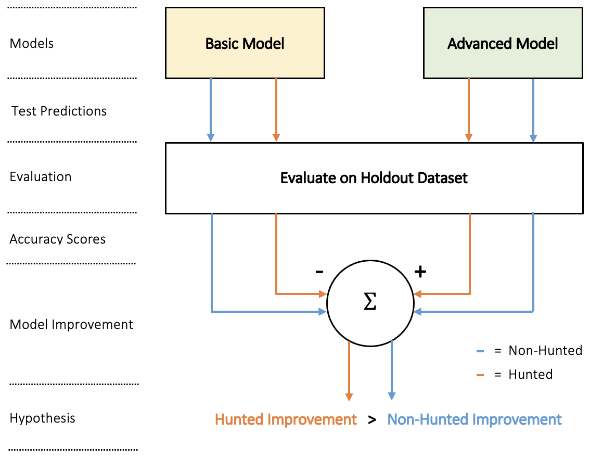
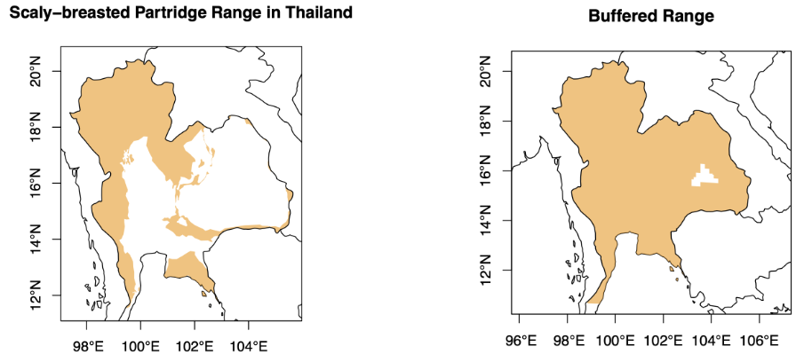
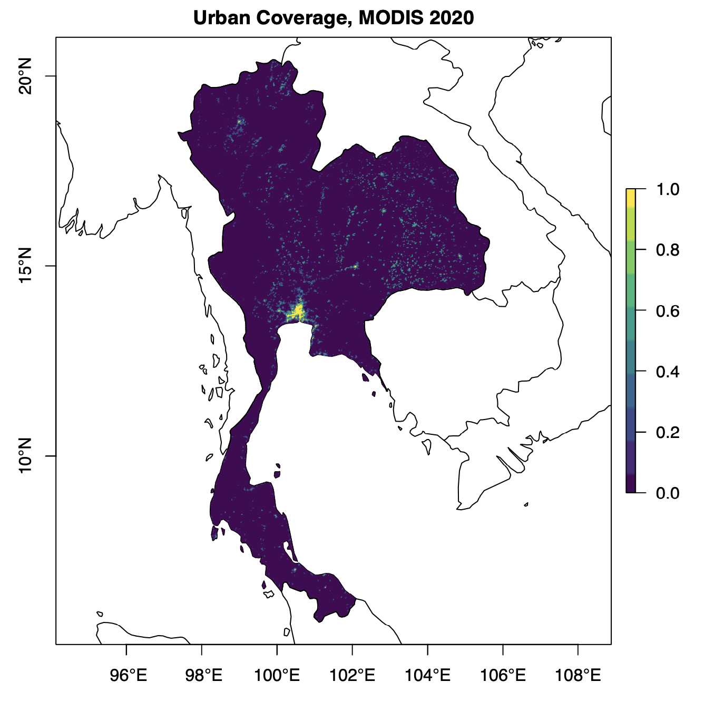
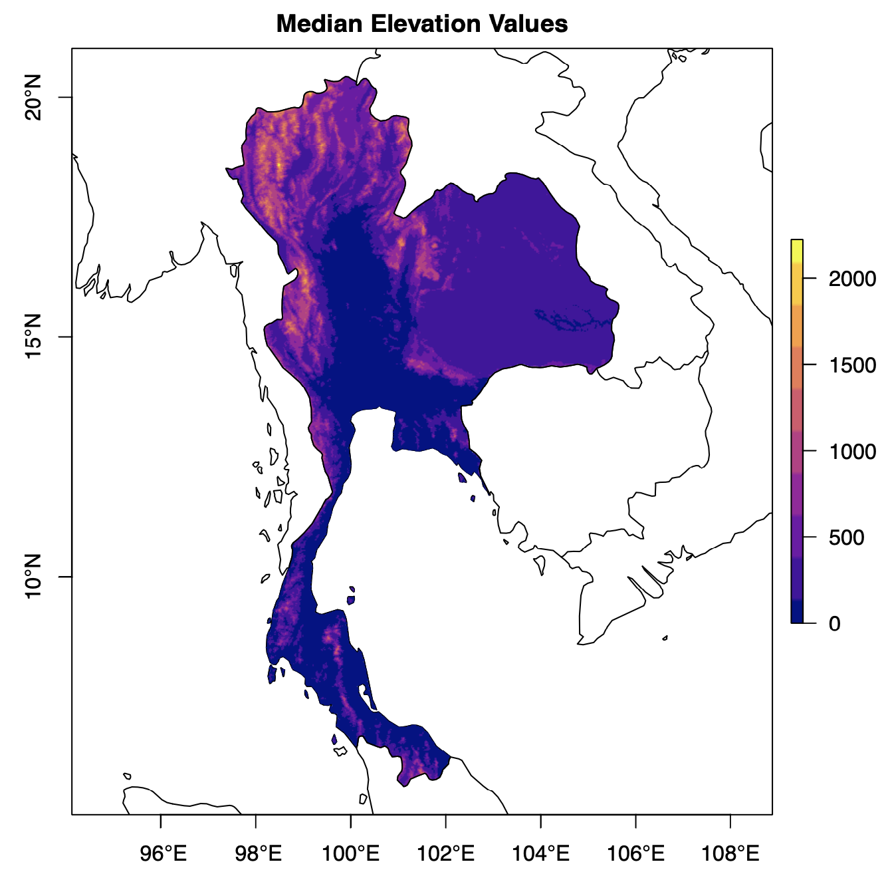
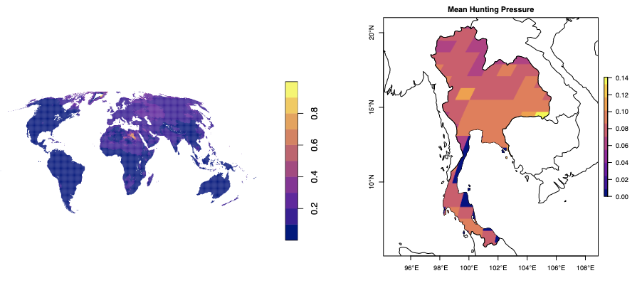
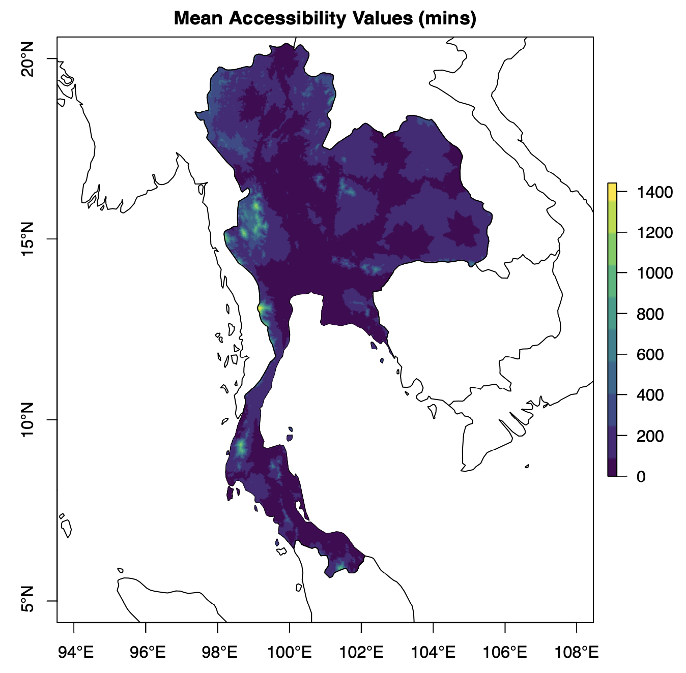
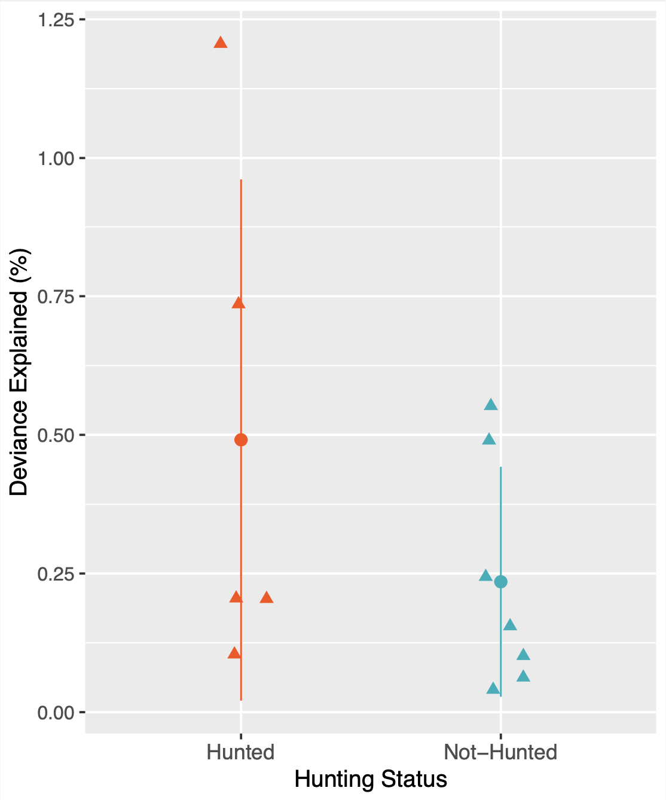

# Inclusion of hunting pressure in biodiversity assessment: a case study of birds in Thailand

 
 

In each section of code contained within this repository, README files are provided that outline instructions for installing and using the relevant pieces of software for replicating and building on results found in this project. For replication, exact datasets can be found [here](https://doi.org/10.5281/zenodo.%20%20%206761830). All code has been written in R, the industry standard language for species distribution modelling. A large proportion of the code contained within this repository has been based upon research completed by the [Cornell Lab of Ornithology](https://cornelllabofornithology.github.io/ebird-best-practices/).

## 1 - Abstract
Hunting and trapping of birds is a major driver of biodiversity loss within South-East Asia. Despite this, scalable biodiversity assessment techniques lack proper consideration of this pressure. Utilising citizen science (eBird) observations, we propose a framework for quantifying the benefit of proxy indicators of hunting pressure for this application. Using Thailand as a case study region, we assess two potential indicators: global pressure maps developed by Harfoot et al. and accessibility. While pressure maps provide no useful information, inclusion of accessibility data improved model goodness-of-fit for hunted species to a greater extent than for the non-hunted control group (deviance explained of 0.491% versus 0.235%). However, the corresponding improvement in predictions, as a result of inclusion, was found to negligible.

## 2 - Approach
### 2.1 Overview
To test whether proxy indicators of hunting pressure (e.g. accessibility) are informative, a null-hypothesis significance testing (NHST) approach is taken. This approach involves comparing the performance of two nested models: the null model and a complex model. The complex model differs from the null model exclusively due to the addition of an extra predictor. Thus, any improvement between the null and the complex model can be directly attributed to the inclusion of this predictor, with some statistical certainty provided by corresponding p-values. Within this project, relative abundance models containing only habitat based predictors and eBird effort variables are known as basic (null) models. Advanced (complex) models include an additional test proxy predictor of hunting pressure. In addition, study species are categorised as either “hunted” or “non-hunted”, providing two distinct groups for model training and testing. Partitioning of species data into these groups has two purposes. Firstly, any relative improvement between groups can be attributed to capturing the intended hunting pressure effect, as opposed to some other adverse anthropogenic process. Secondly, by considering the relative improvement, any performance gain simply as a result of adding more input features, can be avoided. 

  

*Figure 1 - An overview of the NHST approach taken during the project and the corresponding proposed hypothesis (see below).*

### 2.2 Taxa selection: Birds
Birds are an appropriate study taxa for this project because they are a relatively well studied group compared to other taxa. For example, comprehensive data on distribution, behaviour and threats are available for most species. Birds are also the most heavily monitored group - both through formal schemes, such as the Breeding Bird Survey, as well as through citizen science observations. In addition, birds comprise nearly 10,000 living species, with over 1,250 of these currently threatened by H&T - providing the sufficient “hunting diversity” across species which is necessary for partitioning the data.

### 2.3 Ground truth: eBird
While on birdwatching outings, users of eBird record observations within checklists, providing presence data which is freely available from the eBird website. A given checklist entry contains important information such as: the species observed on an outing, the quantity of each species observed and the starting geospatial coordinates of the outing. Checklists also contain data on the distance travelled, the number of observers on the outing, the time of day etc. These so called “effort variables” are useful for reducing the variation in detectability of species that is present across checklists. For example, if there are 10 observers on an outing, it is expected that more species will be observed, even if all other factors are held constant. There is an established modelling framework for working with eBird data, which attempts to mitigate the effect of observer biases as much as possible. This provides a robust modelling foundation which non-habitat factors can be incorporated into.

### 2.4 Spatial extent: Thailand
Thailand is a suitable case study region because it has substantial unregulated H&T. As a result, a decline in populations of hunted species would be expected to occur and be detectable. Importantly, compared to its neighbours, Thailand also has a relatively high usage of eBird, providing ground-truth datasets of greater size for modelling. As more samples are taken, the data becomes more representative of the true distribution - reducing the epistemic uncertainty that exists within models. Finally, hunting habits are relatively uniform across the country, unlike in countries such as India, where large differences in hunting pressure occur across provinces. It should be noted that domain experts were consulted heavily during the case study decision process.

## 3 - Hypothesis
If the additional predictors are a suitable proxy for hunting, we predict that the relative improvement from the simple to the advanced model, for the hunted species group, should be greater than the improvement for the non-hunted species group (as seen in Figure 1). In mathematical terms, if the improvement for non-hunted species is x ≥ 0, then the hypothesised improvement for hunted species is x + y, where y > 0

## 4 - Datasets
### 4.1 Species Data
#### 4.1.1 eBird Checklist Data
For bird occurrence information, eBird checklist data is used. In addition to presence observations of a given target species, an additional sampling event data file was obtained, allowing the checklist data to be zero-filled. Citizen science data is commonly susceptible to various spatial and temporal biases. For example, users tend to submit more records near cities and on the weekends. To reduce the impact of these. biases, the eBird data was sub-sampled, keeping just one checklist per week in each 5km grid cell covering For bird occurrence information, eBird checklist data is used. In addition to presence observations of a Thailand. Additionally, the dataset was also filtered to remove outliers, such that unusual outings do not impact greatly on model performance. Only short checklists (less than 5 hours and 5km), after 2010, are considered in this project. 

  

*Figure 2 - An example map of eBird checklist observations taken within Thailand, for the Great Hornbill.*

#### 4.1.2 Range Polygons
To limit the area over which training and testing checklists are sampled from, we use the range polygons of each species. The range of a species is defined as the geographic area over which that species can be found. However, range polygons provide a relatively crude estimate, with many species presence checklists found just outside the assessed range. Therefore, a buffer distance was added to the range polygon for each species. 100km was chosen as suitable a buffer region, ensuring that the majority of presence checklists are captured and ensuring model training and testing is manageable in terms of processing time. 

  

*Figure 3 - An example of a range polygon limited to Thailand and its corresponding buffered equivalent.*

### 4.2 Habitat Predictors
#### 4.2.1 Landcover Classification Data 
Landcover type is an important habitat predictor of species abundance, since it provides information about the habitat types available to a species. Annual landcover data was obtained from NASA, who make use of MODIS satellite observations and classification algorithms, to categorise 1km pixels into one of 16 possible landcover types - following the University of Maryland (UMD) classification scheme. However, the habitat found at a single point does not provide useful information for predicting species abundance. The habitat present within the 5km region around checklist locations was determined by calculating the proportion of each landcover type. A diameter of 5km is appropriate given the checklist distance limit imposed on the eBird data, while still being a suitable ecological scale for analysing many bird species.

  

*Figure 4 - A map of neighbourhood landcover proportions within Thailand, for urban areas, in 2020.*

#### 4.2.2 Elevation Data
Elevation is an important habitat factor for determining species distributions. A global map of elevation data, at a 1km resolution, was obtained from Amatulli et al. The median elevation within each checklist neighbourhood was calculated, to provide an additional environmental predictor for the models. 

  

*Figure 5 - A map of median elevation values across Thailand.*

### 4.3 Non-Habitat Predictors 
#### 4.3.1 Harfoot Pressure Maps 
One possible predictor of H&T is the global hunting pressure map for birds developed by Harfoot et al, which is shown in Figure 6. Harfoot uses range polygons and threat information contained within the IUCN Red List, in combination with a statistical model, to derive the probability of a species, within a given 50km pixel, being under threat from H&T. Modelling data was collected by calculating the weighted mean value of hunting pressure within each 5km checklist neighbourhood. 

  

*Figure 6 - Harfoot hunting pressure for birds, globally, and restricted to Thailand.*

#### 4.3.2 Accessibility 
Weiss et al. developed a map of global accessibility, at 1km resolution - where accessibility is defined as the minimum travel time to an urban area of more than 50,000 people. Figure 7 shows accessibility values across Thailand for this dataset. Despite the difficulties in stating a causal relationship, accessibility provides a useful predictor of hunting pressure and a valuable sanity check for the outlined approach - since the relationship between hunting pressure and accessibility has been studied previously.

  

*Figure 7 - Minimum travel time to an urban area of >50,000 people (minutes).*

## 5 - Models
### 5.1 Generalised Additive Models 
Species distribution models (SDMs) have previously been constructed using traditional statistical models, as well as newer machine learning (ML) methods. Advanced ML models, in combination with large computational resources, have allowed high resolution species abundance estimates to be produced using eBird data. Due to the complexity and resources required for these techniques, an attempt to replicate or improve the accuracy of these results would have been impractical. In addition, the scientific focus of the project is to provide an initial assessment of proxy indicators of hunting pressure for biodiversity assessment - reducing the requirement for use of cutting-edge or black-box models. Instead, a more traditional generalised additive model (GAM) was selected for use within the project, building on research previously conducted using eBird data. We use a Negative Binomial distribution for the random compoenent of the model.

### 5.2 Implementation
All landcover types with occurrence proportions > 1% were used as predictors, regardless of the species. Although this generalised approach is typically avoided, so as to limit the risk of overfitting, this approach reduces the reliance on domain knowledge of each species’ habitat preferences. Elevation data and eBird effort variables were also used as predictors for all models. As discussed previously, the advanced models are identical to the basic models, except for the inclusion of proxy indicators of hunting pressure (either Harfoot pressure maps or accessibility) as additional model predictors. For each selected species, 80% of the available eBird checklist data was randomly selected for training, with the remaining 20% forming the holdout dataset for testing of each model.

### 5.3 Evaluation Metrics
#### 5.3.1 Prediction Accuracy
In order to assess the prediction accuracy of our models we used two metrics. Firstly we calculated Spear- man’s rank correlation coefficient. This metric spatially assesses the relative abundance predictions. Spearman’s, ρ ∈ [−1, +1], and assesses how well a model ranks sites from highest to lowest abundance, compared to the holdout dataset ranking [52]. A score of +1 indicates a perfect ordering of predictions (i.e. a good model fit), while a score of 0 indicates maximum dissimilarity between rankings. In addition, we calculated the mean absolute deviation (MAD) which assesses the magnitude accuracy of count predictions.

#### 5.3.2 Goodness-of-fit
To assess goodness-of-fit, the improvement in “deviance explained” is calculated. Deviance explained is the ratio of the likelihood of the fitted model to the likelihood of a saturated model. The absolute value of deviance explained is relatively unimportant for our application - the key component of this metric is how much the value improves with the addition of a proxy indicator. P-values provide a statistical test to indicate how likely a set of observations were to occur, should the null hypothesis be true. It is possible that including additional variables Finally, it is essential that goodness-of-fit results are assessed within the ecological context - since GAM models are generally susceptible to performance improvement simply as a result of increased predictor flexibility. Plots of fitted smooth relationships between predicted relative abundance and the tested proxy indicators help accomplish this. A coherent relationship for the Harfoot pressure maps would be a inversely proportional relationship i.e. if hunting pressure increases, relative abundance should decrease. For accessibility, the opposite is true - as accessibility (in minutes) increases, relative abundance should increase.

## 6 - Results 
### 6.1 Analysis
Considering goodness-of-fit, the Harfoot pressure maps produced non-coherent results for both species - implying that the improvement in deviance explained is a result of increased predictor flexibility only. Thus, we conclude that the pressure maps are uninformative of hunting pressure in this context. The main reason for this is probably because of the dataset resolution (50km). Since hunting pressure is expected to vary at a much smaller scale than this, the useful information contained within the dataset for this task is likely limited. The accessibility dataset, however, appears to show more coherent results for the hunted species group - suggesting the improvement in deviance explained can be trusted to a greater extent. According to this metric, the addition of the accessibility predictor showed approximately a two-fold improvement between partitioned groups. Despite the notable relative improvement, the absolute improvement remains small (0.256%) - providing a possible explanation as to why the prediction accuracy metrics do not show significant improvement between models. We conclude that the addition of accessibility, as a proxy indicator of hunting pressure, does improve model goodness-of-fit, however, the performance gain for prediction is negligible. This may partially be due to accessibility being a confounder - also influencing habitat through factors such as logging.

  

*Figure 8 - Improvement in deviance explained as a result of accessibility inclusion.*

### 6.2 Challenges and Limitations
Formation of partitioned species groups was one of the biggest challenges of this project. Firstly, binary classification of species as hunted or non-hunted is not realistic. Instead, birds tend to experience hunting pressure on an analogue scale - resulting in intragroup variation of hunting pressure. Increasing the number of study species would increase robustness to this, however, this was limited by the scarcity of eBird observations for some species. This problem is worsened by the fact that the most endangered species are the most rarely observed. Another major challenge within this project was in selecting appropriate proxy indicators of hunting pressure. Other studies have used socioeconomic indicators such as night lights or human population density, despite previous research highlighting the importance of cultural drivers of H&T. Sourcing appropriate datasets for some of these more nuanced drivers proved challenging.

### 6.3 Further Work
The robustness of the analysis conducted within this project could be improved by compiling a larger list of study species and exploring a greater number of proxy indicators. Design of the code used within this project would make this relatively easy to implement. Robustness could also be improved by using a more advanced algorithm for splitting the eBird checklists into training/testing sets. Further to this, more advanced models could be applied to see how prediction accuracy changes. In particular, ML supervised regression methods provide a logical next step for evaluating alternative models.

## 7 - Contributors 
### 7.1 Author

- Campbell, Hamish. *(AI4ER Cohort-2021, University of Cambridge)*

### 7.2 Supervisors

- Eyres, Alison. *(Cambridge Centre for Carbon Credits, University of Cambridge)*

- Swinfield, Tom. *(Cambridge Centre for Carbon Credits, University of Cambridge)*

- Balmford, Andrew. *(Cambridge Centre for Carbon Credits, University of Cambridge)*

